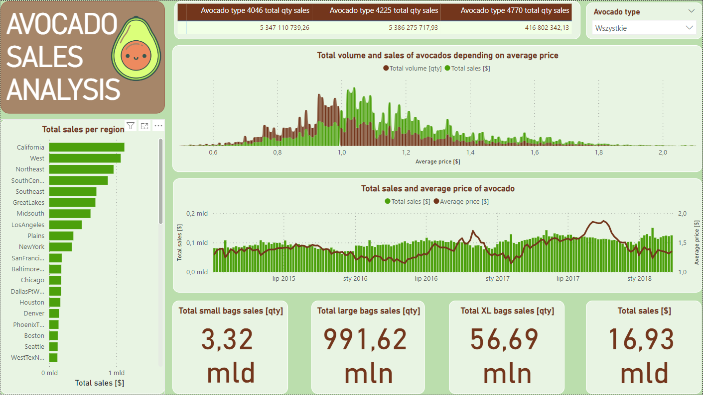

# Avocado Sales Analysis

### Project Overview
---
This project provides insights into avocado sales in the US.

 The dashboard brings information on how sales and average price have staggered over the time and which region of the US is the most profitable. In addition, it allows to track how avocado sales depend on its average price.

The dashboard was made using the Power BI tool.

A preview of the dashboard below:

### Data Sources

The primary dataset used for the analysis was downloaded from [kaggle.com](https://www.kaggle.com/datasets/neuromusic/avocado-prices), where the author indicates hassavocadoboard.com as the source.
